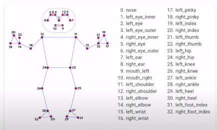

# Walking-Mopping-Detection-in-Videos-Using-Pose-Estimation

# Pose-Estimation
Pose estimation plays a great role here as I didn't use any dataset to come to do this recognition. Angles made by right arm, left arm, right leg and left leg have been calculated with the help of landmarks of the pose that can be seen in the output video.

# Libraries used

- Mediapipe
- OpenCV2
- Numpy
- pafy -> Input is given in the form of a youtube video URL. So this library is used to capture video from youtube URL.

https://user-images.githubusercontent.com/56165694/135873713-ffe6e673-c962-46a3-b121-85006cf84931.mp4

